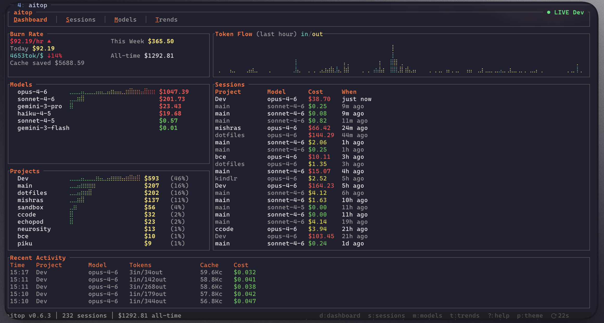
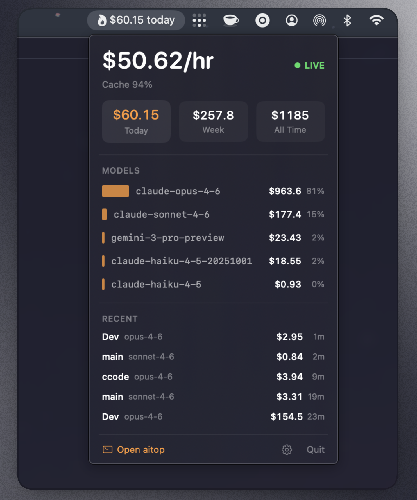
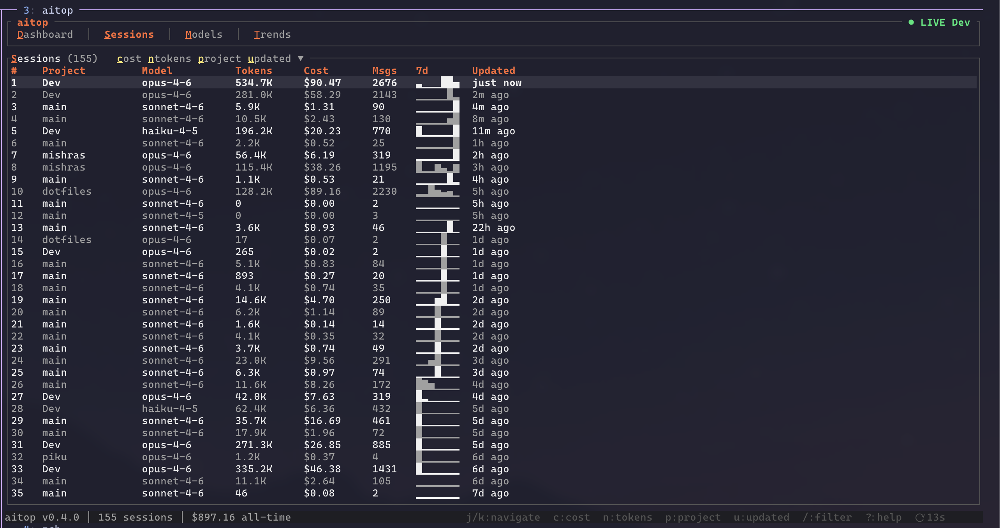
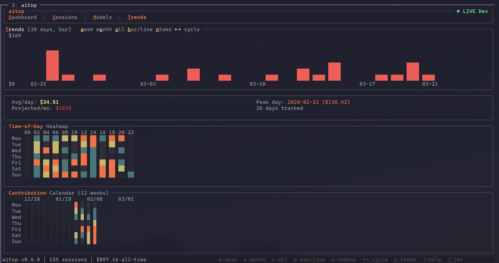

# aitop

[](https://crates.io/crates/aitop)
[](https://opensource.org/licenses/MIT)
[](https://github.com/sponsors/bugkill3r)

**btop for AI** — a terminal dashboard for monitoring AI token usage, costs, and sessions.



Like `btop` monitors your system resources, `aitop` monitors your AI spend. Built for developers who live in the terminal and want to keep an eye on their Claude Code, Gemini CLI, and OpenClaw costs without leaving it.

## Menu Bar App (macOS)



A native macOS menu bar companion that shows your AI spend at a glance. Flame icon (solid = live, outline = idle), click to see burn rate, model breakdown, recent sessions, and cache efficiency. Reads directly from aitop's SQLite DB — no network calls, no aitop process required.

### Install (Homebrew Cask)

```bash
brew install --cask bugkill3r/aitop/aitop-menubar
```

### Install (GitHub Releases)

Download `AitopMenuBar.zip` from the [Releases](https://github.com/bugkill3r/aitop/releases) page, unzip, and move to `/Applications`.

> **macOS note:** Unsigned app may trigger Gatekeeper. Run `xattr -d com.apple.quarantine /Applications/AitopMenuBar.app` after installing.

### Build from source

```bash
cd menubar
make install        # builds and installs to /Applications
open /Applications/AitopMenuBar.app
```

Enable **Launch at Login** in the app's settings to start automatically on boot. Requires macOS 13+ (Ventura).

<details>
<summary>More screenshots</summary>

### Sessions


### Trends


</details>

## Features

- **Live TUI dashboard** with btop-style keyboard shortcuts and highlighted shortcut letters
- **4 views**: Dashboard, Sessions, Models, Trends — switch with `d`/`s`/`m`/`t`
- **Multi-provider** — reads Claude Code, Gemini CLI, and OpenClaw session files
- **Zero auth required** — reads local session files directly, no API keys needed
- **SQLite-backed** — indexes once, instant startup after first run
- **Live file watching** — detects new session data in real-time with fs watcher
- **Burn rate tracking** — see your $/hr, daily spend, weekly totals at a glance
- **Budget gauge** — visual progress bar with color thresholds when budget is configured
- **Model breakdown** — cost, tokens, and cache hit ratio per model
- **Session explorer** — sortable table with inline sparklines, filter/search, and drill-down detail popup
- **Delta banner** — shows cost/token changes since your last check
- **Spend trends** — daily cost chart with projections, heatmap, and contribution calendar
- **Project cost attribution** — cost breakdown by project
- **Token efficiency score** — tokens per dollar, cache savings metrics
- **6 color themes** — catppuccin (default), ember, nord, dracula, gruvbox, mono — cycle with `p`
- **3MB single binary**, zero runtime dependencies, zero network calls

## Install

### Homebrew (macOS & Linux)

```bash
brew install bugkill3r/aitop/aitop
```

### Shell installer

```bash
curl -fsSL https://raw.githubusercontent.com/bugkill3r/aitop/master/install.sh | sh
```

### Cargo

```bash
cargo install aitop
```

### GitHub Releases

Download prebuilt binaries from the [Releases](https://github.com/bugkill3r/aitop/releases) page.

> **macOS note:** Unsigned binaries may trigger Gatekeeper. Run `xattr -d com.apple.quarantine aitop` after downloading.

### Build from source

```bash
git clone https://github.com/bugkill3r/aitop.git
cd aitop
cargo build --release
./target/release/aitop
```

## Usage

```bash
# Launch TUI dashboard
aitop

# Quick table output (non-interactive)
aitop --light

# Choose a theme
aitop --theme dracula

# Custom refresh rate (seconds)
aitop --refresh 5
```

## Keyboard Shortcuts

| Key | Action |
|-----|--------|
| `d` | **D**ashboard view |
| `s` | **S**essions view |
| `m` | **M**odels view |
| `t` | **T**rends view |
| `1`-`4` | Quick switch views |
| `j`/`k` or `↑`/`↓` | Navigate tables |
| `Enter` | Open session detail popup |
| `Esc` | Close popup / dismiss banner |
| `/` | Filter sessions by project |
| `c`/`n`/`o`/`u` | Sort by cost/tokens/project/recent |
| `a` | Toggle sort ascending/descending |
| `w`/`W`/`A` | Trend range: week/month/all |
| `p` | Cycle color theme |
| `r` | Force refresh |
| `?` | Help overlay |
| `q` | Quit |

## How It Works

`aitop` reads session files from Claude Code, Gemini CLI, and OpenClaw, and indexes them into a local SQLite database. Token costs are computed using built-in pricing (extensible via config). The database is incrementally updated — only new data is parsed on subsequent runs. Zero network calls.

## Configuration

Config file at `~/.config/aitop/config.toml`:

```toml
refresh = 2          # Refresh interval in seconds
theme = "catppuccin"  # Color theme
# weekly_budget = 200.0  # Optional budget gauge

# Custom model pricing (per million tokens)
# [model_pricing."some-future-model"]
# input = 5.0
# output = 25.0
# cache_read = 0.50
# cache_creation = 6.25
```

Model pricing is extensible — built-in pricing covers Claude (Opus, Sonnet, Haiku), Gemini, and OpenAI models. Add or override pricing for any model via config.

## Contributing

See [CONTRIBUTING.md](CONTRIBUTING.md) for development setup, testing, and PR guidelines.

## Tech Stack

Rust, Ratatui, Crossterm, SQLite (rusqlite), notify (fs watcher), Tokio

## Support

If aitop saves you from bill shock, consider [sponsoring the project](https://github.com/sponsors/bugkill3r).

## Author

**Saurabh Mishra** — [@bugkill3r](https://github.com/bugkill3r)

## License

MIT
